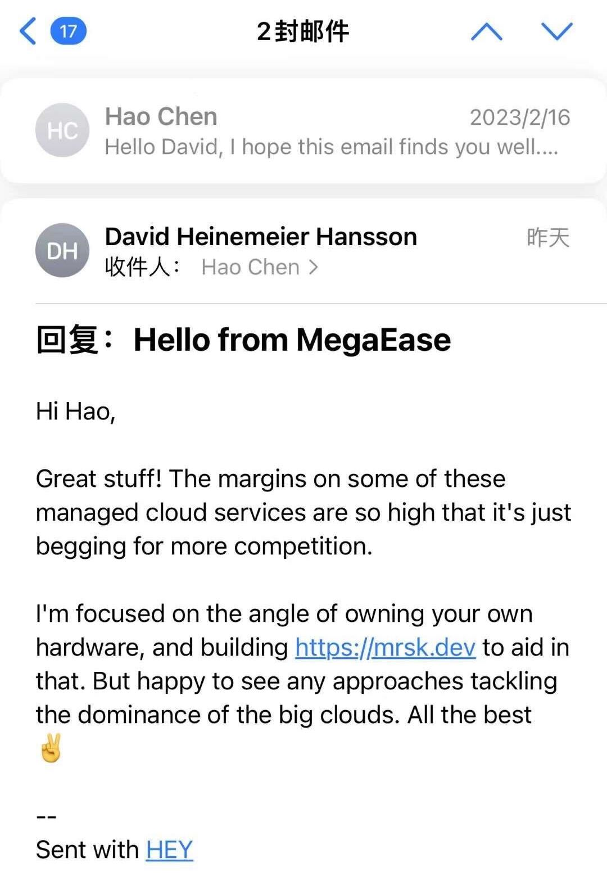

- 作者：atom
# DHH给Hao的回复

from: DHH

to: Hao

March 4, 2023

# Hao 给 DHH写的信

from: Hao

to: DHH

Feb 16, 2023

你好大卫，

我叫陈皓，来自中国，是一个云计算工程师，曾在 AWS 和阿里云工作。 我是您的忠实粉丝，并按照您在 Rework 和 Remote 书籍中所提倡的那样，用小型远程团队做大事。

我看到了你的博客 - [为什么我们要离开云](https://world.hey.com/dhh/why-we-re-leaving-the-cloud-654b47e0)和[我们在 2022 年的云支出](https://dev.37signals.com/our-cloud-spend-in-2022/)，我对此感到非常兴奋，希望这封电子邮件能找到你。

我和你的理解完全一样，正在努力为客户提供一个开放的、低成本的、高可用性的、没有供应商锁定的云服务。 在我看来，AWS、Azure、GCP是IBM/Oracle的其他版本，不开放，对基础设施甚至开源项目都建立了很高的技术壁垒。 所以，我创立了[MegaEase](https://megaease.com/)，试图让云技术开放、免费、低成本。

“离开云端，自己部署云原生”是一个很大的挑战，所以，我认为37Signals的经验对其他人来说是一笔很大的财富，如果你认为这很难，那么其他人就不可能做到这一点。

我想从你的经验中学习，并尝试把它变成一个实用的解决方案/产品，让其他人也能像你一样做同样的事情。

今天，我们有一个MegaEase Cloud平台上线，它可以帮助人们在任何云端甚至私有数据中心部署、监控和运行高可用的开源服务。 

所以，我不仅要学习你们的经验，我还要得到你们的指导，甚至更深入的合作。

此致
浩

Hello David,

My name is Hao Chen from China, I am a Cloud principle engineer used to work for AWS & Alibaba Cloud. I am your big fan and practice the small remote team doing the big things as you advocate in the Rework and Remote books.

I saw your blog - Why we're leaving the cloud & Our cloud spend in 2022 and I am so excited about it, and hope this email finds you well.

I have exactly the same understanding as you and am trying to provide the customer with an open, low-cost, high availability, no vendor lock-in Cloud Service. In my opinion, AWS, Azure, and GCP are other versions of IBM/Oracle, they are not open and they build high technical barriers for infrastructure even for open-source projects. So, I founded MegaEase ([https://megaease.com/](https://megaease.com/)) to try to make the Cloud technology open, free, and low-cost.

“Leaving the cloud and self deploy cloud native” is quite a challenge, so, I think 37Signals’ experience is a big asset for others, if you think this is hard, then other people would be impossible to do this.

I want to learn from your experience and try to turn it into a practical solution/product and let other people can do the same thing likes you.

Today, we have a MegaEase Cloud platform online, which can help people to deploy, monitor and operate the high availability open source service in any Cloud even for private data centers. We helped a customer in China to save their Cloud cost from $4M to $1.5M.

So,  I not only want to learn from your experience, I want to have your guidance, and even more in-depth cooperation.

Best regards

Hao