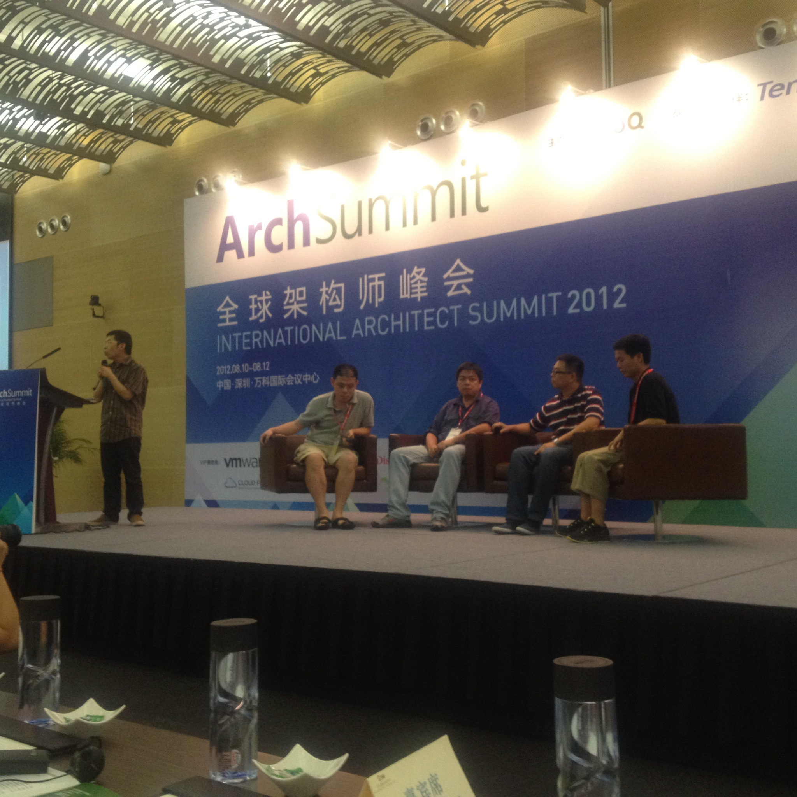

--- 
title: "chenshuo - 纪念陈皓（左耳朵耗子)"
date: 2023-05-18
draft: false
---
# 纪念陈皓（左耳朵耗子）

出处：陈硕的博客 <https://giantchen.wordpress.com/2023/05/18/haoel/>

　　上周日晚上（2023-05-14，美国旧金山时间，下同）我在推上看到[陈皓因突发心梗辞世](https://twitter.com/ghosTM55/status/1657946836643241985)，第一反映是[不敢相信](https://twitter.com/bnu_chenshuo/status/1657952751425589248)，因为几天之前还刚跟他互动过，一起[探查了 AWS EC2 限制网速的手段](https://twitter.com/haoel/status/1654654583149563904)。

　　周一早上一觉醒来，我购买了域名 coolshell.org，打算试着为陈皓的酷壳网 coolshell.cn 做个静态镜像。周二清早，网站的[主体内容完成](https://twitter.com/bnu_chenshuo/status/1658481548319141896)，周二晚上，[release-1.0 顺利完工](https://github.com/chenshuo/coolshell/releases/tag/release-1.0)，剩下的就是些小修小补工作了。忙完这些，才有时间写一点纪念的文字。

## 一面之缘

　　陈皓从 2003 年 3 月开始在 CSDN 写技术文章，早期的成名作是 2004 年初写的[《跟我一起写 Makefile》](https://blog.csdn.net/haoel/article/details/2886)系列文章。我当时在大学里几乎天天逛 CSDN，陈皓的文章经常登上 CSDN 的头版，当时他名气已经不小。2007 年我去 [Platform 公司](https://en.wikipedia.org/wiki/Platform_Computing)应聘，刚巧被问到了 Makefile 的问题，我还顺嘴提了一句陈皓在你们公司是不是很出名，面试官告诉我说陈皓刚离职去了别的公司。2006 年他的作品[被清华大学出版社抄袭](https://blog.csdn.net/haoel/article/details/628927)，陈皓[打赢了官司，让出版社赔了钱](https://blog.csdn.net/haoel/article/details/1383877)，让人佩服。

　　陈皓 2009 年 3 月创立了酷壳网 coolshell.cn，2009 ～ 2012 这几年是他创作的高峰，每隔几天就有新作发表，其中[《程序员技术练级攻略》](https://coolshell.cn/articles/4990.html)的访问量高达上千万，影响甚广。我想他更大的知名度主要是这时期积累起来的，“酷壳博主”成了陈皓日后行走江湖的常用称号。依我看，陈皓技术眼界高，言之有物，不故作清高。那段时间，我每天下班回家，几乎都会刷一会儿酷壳，在网上也[偶有互动](https://twitter.com/haoel/status/53092237634048000)。2011 年，我在香港工作，有次去面试新公司，居然被问到了酷壳上刚刚发表的[“火柴棍面试题”](https://coolshell.org/articles/3961.html)，想来那个面试官也是酷壳的读者。

　　2012 年 8 月，我跟陈皓在线下有过一面之缘，那是在[深圳的一次技术大会](https://www.infoq.cn/article/2012/08/archsummitreview)，他是台上嘉宾，我是台下听众。我自费报名参加了这次技术大会，想借机近距离膜拜一下各位大佬。课间，陈皓在场外抽烟闲聊，得知我是搞金融 IT，还跟我讲路透社的市场行情数据在内网是用 UDP 传的。相比可靠性，股价的及时性更重要，而且价格时刻变动，偶尔丢几个包也不怕。期间不时有人上前跟他合影留念，我帮着拍照。午饭时我们坐一桌，交谈感觉他经常下场亲手解决实际问题，绝不是纸上谈兵、光说不练的主儿。记得那天烤乳鸽味道不错。

　　一年之后，我还在陈皓的酷壳网上投稿发表了[两篇 C++ 技术短文](https://coolshell.cn/articles/author/solstice)。

## 酷壳镜像 coolshell.org

　　现在中文互联网上的信息驳杂、来路不明，信噪比很低。不少技术文章抄来抄去、似是而非、以讹传讹，而陈皓的酷壳网是一股清流。陈皓的知识面比我宽得多，工作经验也远比我丰富，国企外企民企和创业都干过，可谓见多识广。在我比较熟悉的领域，我认为他对相关技术的理解很深刻，对应用的把握也相当准确，也不钻牛角尖，例如《[TCP 的那些事儿](https://coolshell.org/articles/11564.html)（上/下）》、《[从一次经历谈 TIME_WAIT 的那些事](https://coolshell.org/articles/22263.html)》、都是非常好的篇目。

　　近些年，我感觉个人网站消失得很快，以前积攒的链接大多都失效了，就好比 dangling pointers。比方说我上大学的时候几乎天天刷的侯捷先生的个人主页 jjhou.com 以及简体中文镜像 jjhou.csdn.net 已经消失多年。就算是大厂也不一定幸免，URL schema 变来变去是常事，域名也会随着并购而消亡，比如 altera.com 和 atmel.com。曾被广为引用的 www.sgi.com/tech/stl/ 也已[不可访问](https://gcc.gnu.org/pipermail/libstdc++/2018-April/046892.html)，还好我提前做了镜像 http://sgistl.github.io/ ，虽然内容过时了，但历史价值还在。现在遇到有价值的技术资料，必须要原文复制一份才能安心 ，这把我逼成了 `wget --mirror` 熟手。

　　C 语言之父 Dennis M. Ritchie 逝世十多年后，虽然 Bell Labs 几经易手，他的个人主页仍然能[原址访问](https://www.bell-labs.com/usr/dmr/www/)。被誉为 [Guru of the Unix gurus](https://www.salon.com/2000/09/01/rich_stevens/) 的 [W. Richard Stevens](https://en.wikipedia.org/wiki/W._Richard_Stevens) 已经逝世二十余年，他的个人主页还保持着 1999 年的样子 http://www.kohala.com/start/ 。几年前，有人把从 1970 年以来的完整的 Unix 源码历史汇编成了一个 [Git repo](https://github.com/dspinellis/unix-history-repo)，你甚至能用 git blame 找出哪行代码是 Ken Thompson 当年亲手写的。

　　陈皓技术强大且乐于分享，在中文技术圈的影响巨大，帮助过许多人，因此广受尊重，他完全配得上这样的待遇。我不揣冒昧，建了这么一个静态镜像，希望借助 GitHub，让陈皓的文字能长久流传下去。 https://coolshell.org

2023-05-17 初稿。2023-05-18 修订。
